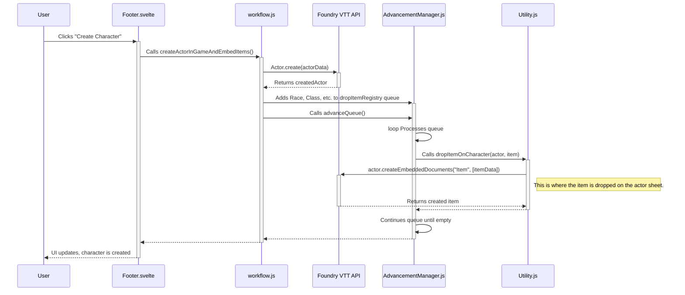

```mermaid
sequenceDiagram
    participant User
    participant Footer.svelte
    participant workflow.js
    participant Foundry VTT API
    participant AdvancementManager.js
    participant Utility.js

    User->>+Footer.svelte: Clicks "Create Character"
    Footer.svelte->>+workflow.js: Calls createActorInGameAndEmbedItems()
    workflow.js->>+Foundry VTT API: Actor.create(actorData)
    Foundry VTT API-->>-workflow.js: Returns createdActor
    workflow.js->>+AdvancementManager.js: Adds Race, Class, etc. to dropItemRegistry queue
    workflow.js->>AdvancementManager.js: Calls advanceQueue()
    AdvancementManager.js->>AdvancementManager.js: loop Processes queue
    AdvancementManager.js->>+Utility.js: Calls dropItemOnCharacter(actor, item)
    Utility.js->>+Foundry VTT API: actor.createEmbeddedDocuments("Item", [itemData])
    Note right of Utility.js: This is where the item is dropped on the actor sheet.
    Foundry VTT API-->>-Utility.js: Returns created item
    Utility.js-->>-AdvancementManager.js: 
    AdvancementManager.js->>AdvancementManager.js: Continues queue until empty
    AdvancementManager.js-->>-workflow.js: 
    workflow.js-->>-Footer.svelte: 
    Footer.svelte-->>-User: UI updates, character is created
```
