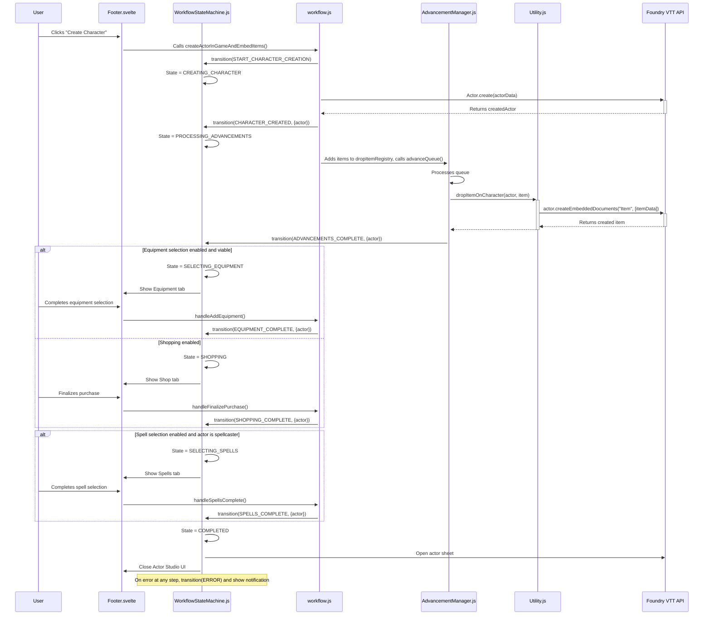

```mermaid
sequenceDiagram
    participant User
    participant Footer.svelte
    participant WorkflowStateMachine.js
    participant workflow.js
    participant AdvancementManager.js
    participant Utility.js
    participant Foundry VTT API

    User->>+Footer.svelte: Clicks "Create Character"
    Footer.svelte->>+workflow.js: Calls createActorInGameAndEmbedItems()
    workflow.js->>+WorkflowStateMachine.js: transition(START_CHARACTER_CREATION)
    WorkflowStateMachine.js->>WorkflowStateMachine.js: State = CREATING_CHARACTER
    workflow.js->>+Foundry VTT API: Actor.create(actorData)
    Foundry VTT API-->>-workflow.js: Returns createdActor
    workflow.js->>+WorkflowStateMachine.js: transition(CHARACTER_CREATED, {actor})
    WorkflowStateMachine.js->>WorkflowStateMachine.js: State = PROCESSING_ADVANCEMENTS
    workflow.js->>+AdvancementManager.js: Adds items to dropItemRegistry, calls advanceQueue()
    AdvancementManager.js->>AdvancementManager.js: Processes queue
    AdvancementManager.js->>+Utility.js: dropItemOnCharacter(actor, item)
    Utility.js->>+Foundry VTT API: actor.createEmbeddedDocuments("Item", [itemData])
    Foundry VTT API-->>-Utility.js: Returns created item
    Utility.js-->>-AdvancementManager.js: 
    AdvancementManager.js->>WorkflowStateMachine.js: transition(ADVANCEMENTS_COMPLETE, {actor})

    alt Equipment selection enabled and viable
        WorkflowStateMachine.js->>WorkflowStateMachine.js: State = SELECTING_EQUIPMENT
        WorkflowStateMachine.js->>Footer.svelte: Show Equipment tab
        User->>Footer.svelte: Completes equipment selection
        Footer.svelte->>workflow.js: handleAddEquipment()
        workflow.js->>WorkflowStateMachine.js: transition(EQUIPMENT_COMPLETE, {actor})
    else Shopping enabled
        WorkflowStateMachine.js->>WorkflowStateMachine.js: State = SHOPPING
        WorkflowStateMachine.js->>Footer.svelte: Show Shop tab
        User->>Footer.svelte: Finalizes purchase
        Footer.svelte->>workflow.js: handleFinalizePurchase()
        workflow.js->>WorkflowStateMachine.js: transition(SHOPPING_COMPLETE, {actor})
    end

    alt Spell selection enabled and actor is spellcaster
        WorkflowStateMachine.js->>WorkflowStateMachine.js: State = SELECTING_SPELLS
        WorkflowStateMachine.js->>Footer.svelte: Show Spells tab
        User->>Footer.svelte: Completes spell selection
        Footer.svelte->>workflow.js: handleSpellsComplete()
        workflow.js->>WorkflowStateMachine.js: transition(SPELLS_COMPLETE, {actor})
    end

    WorkflowStateMachine.js->>WorkflowStateMachine.js: State = COMPLETED
    WorkflowStateMachine.js->>Foundry VTT API: Open actor sheet
    WorkflowStateMachine.js->>Footer.svelte: Close Actor Studio UI

    Note over WorkflowStateMachine.js: On error at any step, transition(ERROR) and show notification
```
